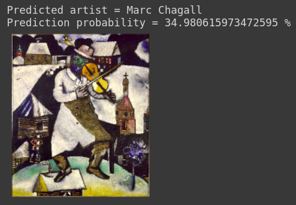
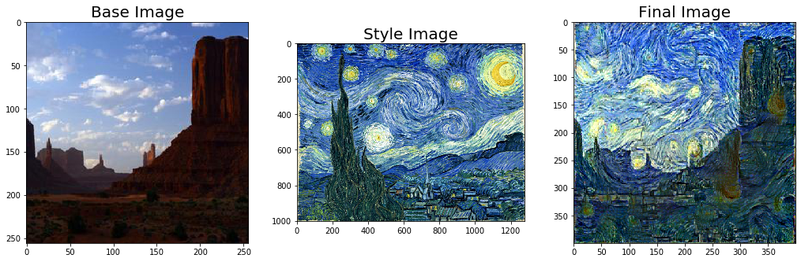
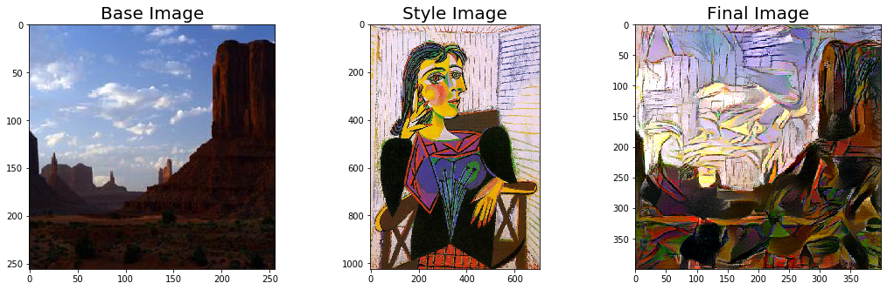
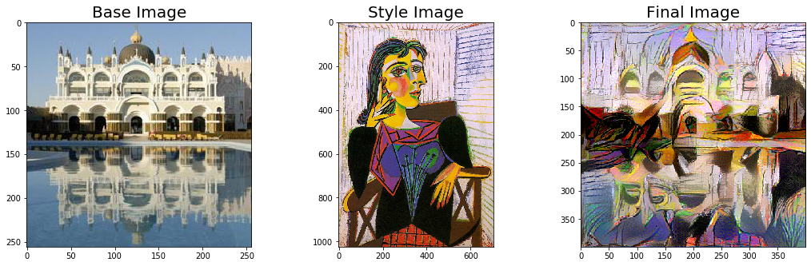

# DaVinci

Neural Style Transfer: Generating artwork from images

### Methodology

The [Artworks dataset](https://www.kaggle.com/ikarus777/best-artworks-of-all-time) was used to perform the following tasks:

* Image Classification
* Neural Style Transfer

### Image Classification

The models Resnet-50, Xception and MobileNet were used for classification, taking the pre-trained weights from ImageNet and finetuning them on this dataset. The best F-1 we achieved was 86% (from ResNet). Here is an example classification:

### Neural Style Transfer

The VGG model was used to stylize given photographs into the styles of certain artists. The approach was to minimize the content and style losses from the base image while converting to style image so that the base image gains the style of the style image, while not losing it's content. Here are some examples:

